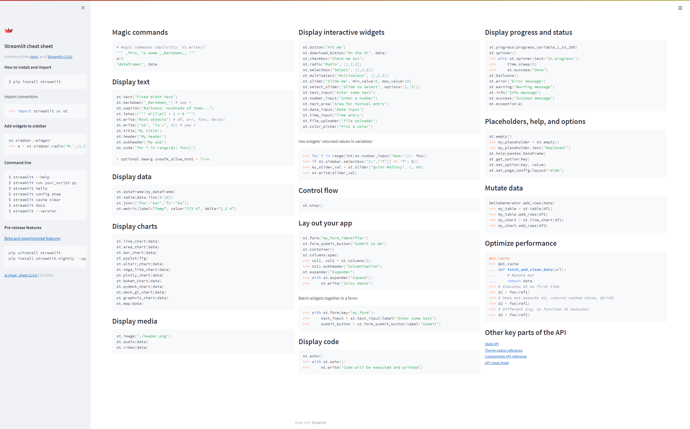

# Streamlit

Streamlit can be a useful tool for **rapid prototyping** web applications without the need for writing any backend code at all.

## Get started

### Install

```bash
pip install streamlit
```

### Run

```bash
streamlit run main.py
```

## Cheat sheet



Reference: https://github.com/daniellewisDL/streamlit-cheat-sheet

## Guide

https://docs.streamlit.io/library/get-started